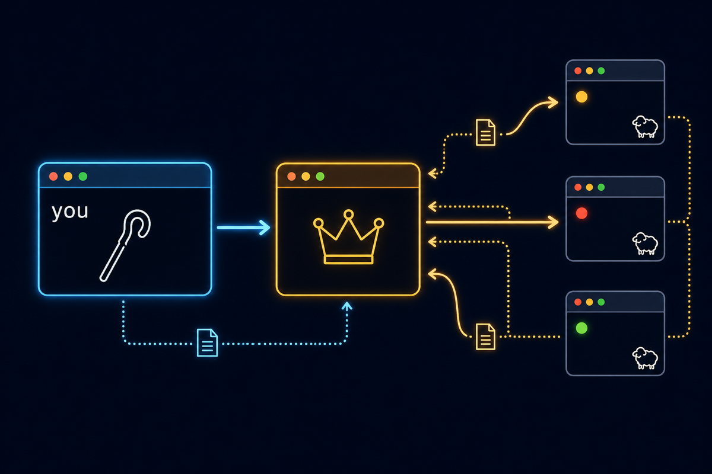
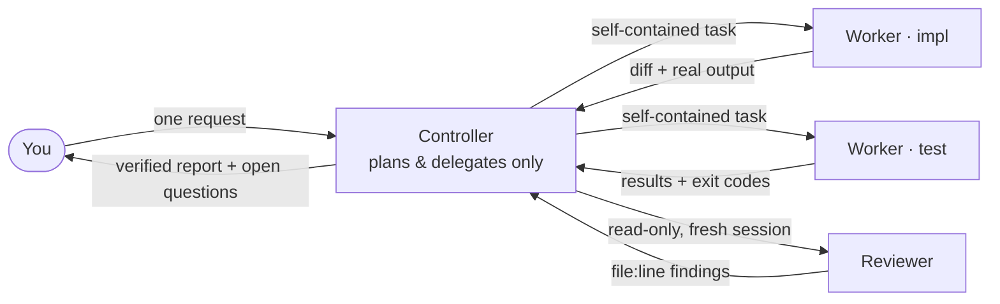

<p align="center">
  
</p>

<h1 align="center">hod — Herdr Orchestrator Driver</h1>

<p align="center">
  <strong>One command in. One accountable controller. A herd of coding agents, verified.</strong>
</p>

<p align="center">
  <a href="https://github.com/hapo-nghialuu/herdr-orchestrator/actions/workflows/validate.yml"></a>
  <a href="https://github.com/hapo-nghialuu/herdr-orchestrator/releases"></a>
  
  <a href="LICENSE"></a>
</p>

---

`hod` turns one coding-agent CLI — Claude Code, Codex, or Grok Build — into an
**accountable controller** that plans, delegates to other agents through
[Herdr](https://herdr.dev/), verifies their work with real evidence, and
reports back with the questions only you can answer.

It ships as two deliberately separate parts:

| Part | What it is | What it does |
| --- | --- | --- |
| **The skill** | Markdown contract (`SKILL.md` + `references/`) | The brain: delegation rules, lifecycle discipline, verification, safety boundaries. Read by the LLM, enforced by its judgment |
| **The `hod` CLI** | A single bash binary | The hands: installs the skill anywhere, diagnoses the setup, manages role permission profiles. Contains **zero** orchestration logic |

This split is intentional: *code does the mechanical work, the LLM does the
judgment work* — and neither pretends to do the other's job.

> Independent community project. Not affiliated with Herdr, OpenAI, Anthropic, or xAI.

## Install

```bash
curl -fsSL https://raw.githubusercontent.com/hapo-nghialuu/herdr-orchestrator/main/install.sh | sh
hod status
```

Pin a version instead of tracking `main`:

```bash
curl -fsSL https://raw.githubusercontent.com/hapo-nghialuu/herdr-orchestrator/main/install.sh | HOD_REF=v0.1.0 sh
```

That is the whole setup: no workspace layout to rearrange, no per-project
ceremony. `hod` clones the skill into `~/.hod/skill/`, puts the `hod`
executable on `~/.local/bin/`, and links global adapters so every agent CLI
can find the skill. Attach a single project instead with
`hod install --project /path/to/repo`.

**Prerequisites**: macOS or Linux · [Herdr](https://herdr.dev/) · `git`, `jq` ·
at least one agent CLI installed and authenticated (`claude`, `codex`, or
`grok`). Recommended: `herdr integration install claude` (and `codex`) so the
sidebar shows authoritative agent states.

## How it works

<p align="center">
  
</p>



1. **You speak to one agent.** Inside a Herdr pane, name the skill explicitly:

   ```text
   Use Herdr and the herdr-orchestrator skill to implement the health
   endpoint. One writer, one read-only reviewer. Do not commit or push.
   Return changed files, test results, and unresolved questions.
   ```

2. **The controller runs a preflight** — refuses to act unless it is inside a
   Herdr-managed pane (`HERDR_ENV=1`), the server is compatible, and the
   installed command family matches `--help` exactly. Anything ambiguous
   fails closed.

3. **Workers are addressed as if you wrote the prompt.** Herdr input carries
   no sender field, so wording is the only thing that leaks routing — the
   contract forbids "you are a sub-agent, report to the parent" framing
   entirely.

4. **Nothing is believed, everything is verified.** An agent's `done` state
   is a screen heuristic, not proof. The controller reads real diffs, runs
   checks in panes with per-run sentinels (so stale `passed` text can never
   be mistaken for fresh evidence), and sends material changes to an
   independent reviewer in a fresh session.

5. **The report ends with what still needs you** — every worker's open
   questions are harvested and attributed, never swallowed by the summary.

**You know it is working when new panes appear in the Herdr sidebar.** If you
only see "background agents" messages and the sidebar stays still, the CLI is
using its internal sub-agents, not Herdr orchestration — restate the request
naming Herdr and the skill.

## The `hod` command

| Command | What it does |
| --- | --- |
| `hod install` | Clone/update the skill and link global adapters (`~/.claude/skills/`, `~/.agents/skills/`) |
| `hod install --project <path>` | Attach one Git project instead — any location, no sibling layout required |
| `hod install --ref <tag>` | Pin the skill to a release tag |
| `hod status` | ✓/✗ one-liners: prerequisites, agent CLIs, checkout, adapters, PATH. Exit 0 when healthy |
| `hod doctor` | Everything `status` checks plus remediation commands, adapter resolution, checkout mode (branch vs pinned), integration status |
| `hod update` | Fast-forward the skill; a pinned checkout moves to the newest tag. Refuses a dirty tree |
| `hod settings list` | Show the role permission profiles and ready-to-paste start commands |
| `hod settings install [--role <r>] [--force]` | Write role profiles into a project's `.claude/` |
| `hod uninstall [--purge]` | Remove only adapters that resolve into `~/.hod/skill`; never touches foreign files |

Everything `hod` runs against Herdr is **read-only** (`herdr status`,
`herdr integration status`). It never starts agents, never installs
integrations, never mutates a session — that authority stays with you and the
controller.

## Role profiles: rules the harness enforces

A role written in a prompt is advice. A role installed as a permission profile
is a boundary the agent cannot cross, even if asked to:

```bash
hod settings install          # writes .claude/settings.<role>.json + git-excludes them
```

| Role | Denied | Meaning |
| --- | --- | --- |
| `controller` | `Edit`/`Write` + `npm` `cargo` `make` `go` `pytest` `xcodebuild` `swift` … + `git push/merge` | Plans, delegates, reads evidence. Cannot code, build, or test by hand |
| `impl` | `git push` `merge` `reset --hard` `tag` | Writes code freely; cannot publish |
| `reviewer` | edit tools + writing git commands + `rm` | Genuinely read-only |

```bash
herdr agent start impl --kind claude --pane "$p" \
  -- --continue --settings .claude/settings.impl.json

herdr agent start reviewer --kind claude --pane "$p2" \
  -- --settings .claude/settings.reviewer.json     # fresh session, never --continue
```

Two rules proven by live testing, not theory:

- **Never combine a profile with `--dangerously-skip-permissions`** — that
  flag overrides every deny rule and the profile stops enforcing anything.
- **A reviewer is never a resumed session.** `--continue`/`--resume` restores
  exactly the bias an independent review exists to remove.

Profiles carry permission boundaries only — never credentials. Claude Code
merges them over the settings it already loads, so tokens, endpoints, and
hooks are inherited untouched. (Codex and Grok enforce roles through their own
flags — sandbox/approval modes and allow/deny rules; see the
[routing reference](references/model-routing-and-context.md).)

## What the skill guarantees

The contract the controller operates under, distilled:

- **Direct-user voice** — workers believe they are talking to you; internal
  routing never leaks into prompts.
- **Your authority is never invented** — no fabricated approvals; scope,
  risk, cost, and anything externally visible comes back to you. Delegation
  is never used to obtain authority you did not grant.
- **Fail-closed** — unknown command families, malformed JSON, ambiguous
  targets: stop and report, never guess pane IDs or syntax.
- **Evidence over claims** — verbal `done` is not completion; diffs, fresh
  sentinel-guarded check output, and independent review are.
- **One file, one writer** — parallel workers own disjoint paths; shared
  manifests get a single integration owner; conflicts go to a named
  integrator, never the controller's own hands.
- **Conservative cleanup** — panes and worktrees the task created stay
  available for your inspection until you authorize removal.

Full operating rules live in [`SKILL.md`](SKILL.md) and seven focused
references loaded only when needed:

| Reference | Covers |
| --- | --- |
| [Delegation & direct-user contract](references/delegation-and-direct-user-contract.md) | Prompt voice, authority, coordinator-only mode, question harvesting |
| [Agent lifecycle & waits](references/agent-lifecycle-and-waits.md) | Start/prompt/wait/read, state table, sentinels, continue-vs-fresh sessions |
| [Model routing & context](references/model-routing-and-context.md) | Kind/model selection, native flags, role enforcement, task packets |
| [Parallel worktrees & ownership](references/parallel-worktrees-and-ownership.md) | Team sizing, file ownership, ledger, integration |
| [Portfolio hierarchy](references/portfolio-hierarchy.md) | One orchestrator, many projects: tiers, policies, persistent state |
| [Verification & safety](references/verification-and-safety.md) | Evidence rules, destructive boundaries, privacy, cleanup |
| [Legacy Herdr 0.7.1](references/legacy-herdr-0.7.1.md) | Compatibility path for the old command family |

## Scaling up

- **Parallel work without collisions** — put independent tasks in separate
  Git worktrees (`herdr worktree create`), one agent per worktree; ownership
  stays disjoint even across checkouts.
- **Mixed teams** — `--kind claude|codex|grok` per worker, models passed
  through the `--` separator with exact IDs (`-m gpt-5.6-sol
  -c model_reasoning_effort=max`, `-m grok-4.5`, `--model <id>`).
- **Many projects, one orchestrator** — the opt-in
  [portfolio mode](docs/portfolio-orchestration.md): one controller per
  project workspace, a strict two-level delegation cap, and user-authored
  policy files stored *outside* every checkout so no agent can widen its own
  authority.

## Documentation

| Guide | For |
| --- | --- |
| [Quickstart — four levels](docs/quickstart.md) | Start in 2 minutes; climb only when a level feels limiting |
| [Getting started](docs/getting-started.md) | Full setup detail, including the manual sibling-workspace alternative |
| [Usage guide](docs/usage-guide.md) | Prompt recipes: pipelines, parallel teams, steering, model selection |
| [Portfolio orchestration](docs/portfolio-orchestration.md) | Managing several projects with one orchestrator |
| [Project layouts](docs/project-layouts.md) | Sharing with a team: sibling, meta-repo, vendored |
| [Troubleshooting](docs/troubleshooting.md) | Adapters, preflight, capability mismatches |

## Repository structure

```text
herdr-orchestrator/
├── SKILL.md                    # agent-facing entry point (always loaded)
├── references/                 # detailed contracts (loaded on demand)
├── bin/hod                     # the CLI — install, doctor, settings, update
├── install.sh                  # curl | sh bootstrap (HOD_REF pins a version)
├── scripts/
│   ├── link-project.sh         # manual sibling-layout linker
│   ├── link-all-projects.sh    # bulk variant
│   ├── test-hod.sh             # 55 hermetic CLI tests
│   ├── test-link-project.sh    # 22 linker tests
│   └── validate.sh             # syntax + frontmatter + markdown links
├── templates/                  # policy template + role permission profiles
├── docs/                       # human guides
├── assets/                     # README artwork
└── .github/workflows/          # CI: all test entrypoints on Ubuntu + macOS
```

## What it does not do

- Install, authenticate, or pay for agent CLIs.
- Grant permissions you did not already provide.
- Force every task into multi-agent mode — small tasks stay single-agent.
- Treat an agent's `done` state as proof of correctness.
- Commit, merge, push, publish, or delete anything without your authority.

## Known limitations

- Worker-role enforcement via settings profiles covers Claude Code; Codex and
  Grok use their own native flags (documented, not templated).
- Capability detection reads installed `--help` output — a future Herdr that
  rewords its help fails closed (safely) until the skill is updated.
- Herdr is pre-1.0; this project tracks current stable (tested against 0.7.5)
  with a best-effort legacy path for 0.7.1.
- Native Windows is untested.

## Contributing

Small, focused PRs welcome. Read [CONTRIBUTING.md](CONTRIBUTING.md) — in
short: preserve the direct-user contract, back behavior claims with installed
`--help` evidence, run `./scripts/validate.sh`, `./scripts/test-hod.sh`, and
`./scripts/test-link-project.sh` before pushing. Security reports go through
[SECURITY.md](SECURITY.md).

## License

[MIT](LICENSE) © 2026 Luu Trung Nghia
