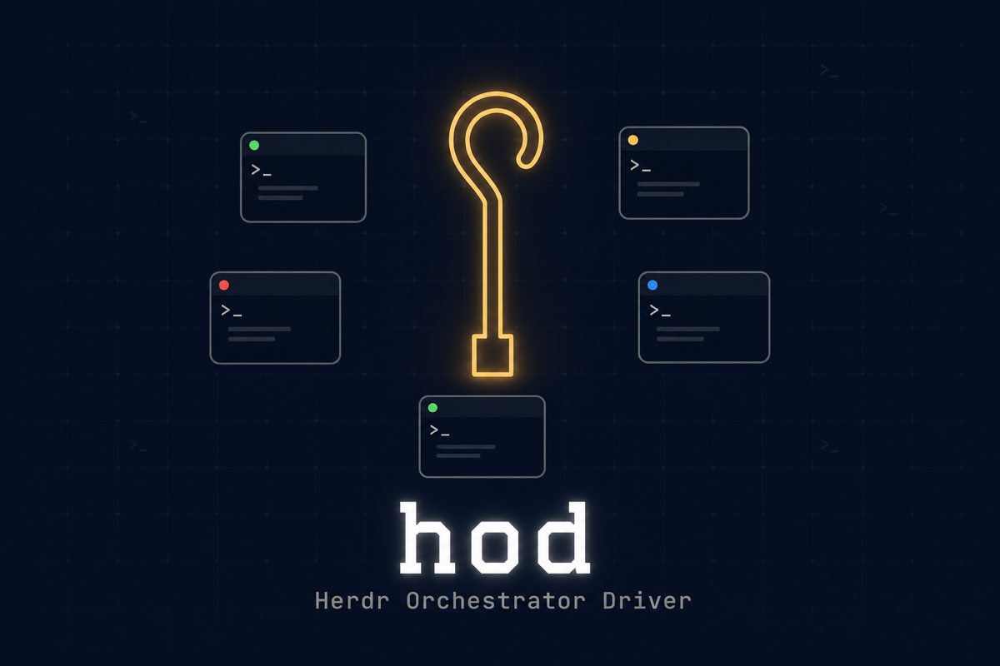
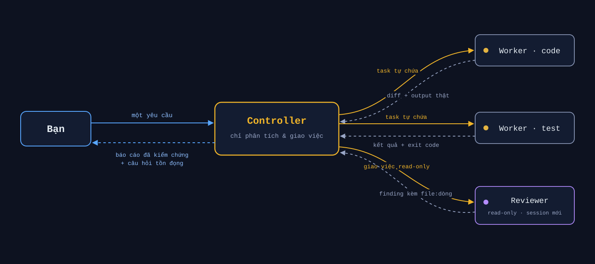

<p align="center">
  
</p>

<h1 align="center">hod — Herdr Orchestrator Driver</h1>

<p align="center">
  <strong>Một lệnh để bắt đầu. Một controller chịu trách nhiệm. Cả đàn coding agent — có kiểm chứng.</strong>
</p>

<p align="center">
  <a href="README.md">English</a> · <b>Tiếng Việt</b>
</p>

<p align="center">
  <a href="https://github.com/hapo-nghialuu/hod/actions/workflows/validate.yml"></a>
  <a href="https://github.com/hapo-nghialuu/hod/releases"></a>
  
  <a href="LICENSE"></a>
</p>

---

`hod` biến một coding-agent CLI — Claude Code, Codex, hoặc Grok Build — thành
**controller chịu trách nhiệm duy nhất**: lập kế hoạch, giao việc cho các
agent khác thông qua [Herdr](https://herdr.dev/), kiểm chứng kết quả bằng
bằng chứng thật, và báo cáo lại kèm những câu hỏi chỉ bạn mới trả lời được.

Dự án gồm hai phần được tách bạch có chủ đích:

| Phần | Là gì | Làm gì |
| --- | --- | --- |
| **Skill** | Bản contract Markdown (`SKILL.md` + `references/`) | Bộ não: luật ủy quyền, kỷ luật vòng đời, kiểm chứng, ranh giới an toàn. LLM đọc và thi hành bằng phán đoán |
| **CLI `hod`** | Một binary bash duy nhất | Đôi tay: cài skill vào bất kỳ đâu, chẩn đoán setup, quản lý profile quyền theo vai. Chứa **zero** logic điều phối |

Việc tách đôi này là cố ý: *code làm việc máy móc, LLM làm việc phán đoán* —
không bên nào giả vờ làm việc của bên kia.

> Dự án cộng đồng độc lập. Không liên kết với Herdr, OpenAI, Anthropic, hay xAI.

## Cài đặt

```bash
curl -fsSL https://raw.githubusercontent.com/hapo-nghialuu/hod/main/install.sh | sh
hod status
```

Ghim một phiên bản thay vì bám theo `main`:

```bash
curl -fsSL https://raw.githubusercontent.com/hapo-nghialuu/hod/main/install.sh | HOD_REF=v0.1.0 sh
```

Chỉ vậy là xong: không phải sắp xếp lại thư mục, không thủ tục theo từng dự
án. `hod` clone skill về `~/.hod/skill/`, đặt lệnh `hod` vào `~/.local/bin/`,
và tạo adapter global để mọi agent CLI đều thấy skill. Muốn gắn riêng một dự
án: `hod install --project /đường/dẫn/repo`.

**Yêu cầu**: macOS hoặc Linux · [Herdr](https://herdr.dev/) · `git`, `jq` ·
ít nhất một agent CLI đã cài và đăng nhập (`claude`, `codex`, hoặc `grok`).
Khuyến nghị: `herdr integration install claude` (và `codex`) để sidebar hiển
thị trạng thái agent chính xác.

## Cách hoạt động

<p align="center">
  
</p>

1. **Bạn chỉ nói chuyện với một agent.** Trong pane Herdr, gọi tên skill một
   cách tường minh:

   ```text
   Dùng Herdr và skill herdr-orchestrator để làm endpoint health.
   Một writer, một reviewer read-only. Không commit, không push.
   Trả về file đã đổi, kết quả test, và câu hỏi tồn đọng.
   ```

2. **Controller chạy preflight** — từ chối hành động nếu không ở trong pane
   do Herdr quản lý (`HERDR_ENV=1`), server không tương thích, hoặc bộ lệnh
   cài đặt không khớp `--help`. Mọi thứ mơ hồ → dừng lại (fail-closed).

3. **Worker được nói chuyện như thể chính bạn viết prompt.** Tin nhắn Herdr
   không có trường người gửi, nên từ ngữ là thứ duy nhất có thể làm lộ cơ chế
   định tuyến — contract cấm hoàn toàn kiểu "bạn là sub-agent, báo cáo lại
   cấp trên".

4. **Không tin lời khai, chỉ tin bằng chứng.** Trạng thái `done` của agent
   chỉ là suy đoán từ màn hình, không phải bằng chứng. Controller đọc diff
   thật, chạy check trong pane với sentinel theo từng lần chạy (chữ `passed`
   cũ trên màn hình không bao giờ bị nhận nhầm là kết quả mới), và đưa thay
   đổi đáng kể cho một reviewer độc lập chạy session mới.

5. **Báo cáo kết thúc bằng những gì còn cần bạn quyết** — câu hỏi tồn đọng
   của từng worker được thu hoạch và ghi rõ nguồn, không bao giờ bị bản tóm
   tắt nuốt mất.

**Dấu hiệu chạy đúng: sidebar Herdr mọc pane mới.** Nếu chỉ thấy dòng
"background agents" mà sidebar đứng im — CLI đang dùng sub-agent nội bộ chứ
không phải điều phối qua Herdr; hãy nhắc lại yêu cầu kèm tên Herdr và skill.

## Lệnh `hod`

| Lệnh | Tác dụng |
| --- | --- |
| `hod install` | Clone/cập nhật skill và tạo adapter global (`~/.claude/skills/`, `~/.agents/skills/`) |
| `hod install --project <path>` | Gắn một dự án Git — vị trí bất kỳ, không cần layout sibling |
| `hod install --ref <tag>` | Ghim skill vào một tag phát hành |
| `hod status` | Một dòng ✓/✗ cho từng mục: công cụ, agent CLI, checkout, adapter, PATH. Exit 0 khi khỏe |
| `hod doctor` | Như `status` cộng thêm lệnh khắc phục, kiểm tra adapter, chế độ checkout (branch/pinned), trạng thái integration |
| `hod update` | Fast-forward skill; checkout đang pin sẽ nhảy tới tag mới nhất. Từ chối khi cây có sửa đổi |
| `hod settings list` | Liệt kê profile quyền theo vai + lệnh khởi động dán được ngay |
| `hod settings install [--role <r>] [--force]` | Ghi profile theo vai vào `.claude/` của dự án |
| `hod uninstall [--purge]` | Chỉ xóa adapter trỏ về `~/.hod/skill`; không bao giờ đụng file lạ |

Mọi lệnh `hod` gọi tới Herdr đều **chỉ đọc** (`herdr status`,
`herdr integration status`). Nó không bao giờ khởi động agent, không cài
integration, không thay đổi phiên — quyền đó thuộc về bạn và controller.

## Profile theo vai: luật do harness cưỡng chế

Vai trò viết trong prompt là lời khuyên. Vai trò cài thành profile quyền là
ranh giới agent **không thể** vượt qua, kể cả khi bị yêu cầu:

```bash
hod settings install     # ghi .claude/settings.<vai>.json + tự thêm git exclude
```

| Vai | Bị chặn | Ý nghĩa |
| --- | --- | --- |
| `controller` | `Edit`/`Write` + `npm` `cargo` `make` `go` `pytest` `xcodebuild` `swift`… + `git push/merge` | Lập kế hoạch, giao việc, đọc bằng chứng. Không tự code, build, hay test |
| `impl` | `git push` `merge` `reset --hard` `tag` | Code thoải mái; không phát tán ra ngoài |
| `reviewer` | tool sửa file + lệnh git ghi + `rm` | Read-only thật sự |

```bash
herdr agent start impl --kind claude --pane "$p" \
  -- --continue --settings .claude/settings.impl.json

herdr agent start reviewer --kind claude --pane "$p2" \
  -- --settings .claude/settings.reviewer.json     # session mới, không bao giờ --continue
```

Hai luật được chứng minh bằng test thật, không phải lý thuyết:

- **Không bao giờ kết hợp profile với `--dangerously-skip-permissions`** —
  cờ đó ghi đè mọi luật `deny`, profile lập tức mất hết tác dụng.
- **Reviewer không bao giờ là session resume.** `--continue`/`--resume` khôi
  phục đúng cái thiên kiến mà review độc lập sinh ra để loại bỏ.

Profile chỉ chứa ranh giới quyền — không bao giờ chứa credential. Claude Code
gộp profile lên các settings đã nạp sẵn, nên token, endpoint và hooks được kế
thừa nguyên vẹn. (Codex và Grok cưỡng chế vai bằng cờ riêng — sandbox/approval
và allow/deny; xem [reference routing](references/model-routing-and-context.md).)

## Skill cam kết những gì

Bản contract mà controller vận hành theo, cô đọng lại:

- **Giọng người dùng trực tiếp** — worker tin rằng nó đang nói chuyện với
  bạn; cơ chế định tuyến không bao giờ lộ vào prompt.
- **Không bịa thẩm quyền của bạn** — không phê duyệt tự chế; phạm vi, rủi
  ro, chi phí, mọi thứ hướng ra ngoài đều quay về hỏi bạn. Không bao giờ dùng
  việc ủy quyền để lấy quyền mà bạn chưa cấp.
- **Fail-closed** — bộ lệnh lạ, JSON hỏng, đích mơ hồ: dừng và báo cáo,
  không bao giờ đoán pane ID hay cú pháp.
- **Bằng chứng trên lời khai** — `done` bằng miệng không phải hoàn thành;
  diff, output check mới có sentinel, và review độc lập mới là.
- **Một file, một người viết** — worker song song sở hữu vùng file tách
  biệt; manifest dùng chung có một integration owner; conflict giao cho một
  integrator, không bao giờ do tay controller.
- **Dọn dẹp bảo thủ** — pane và worktree do task tạo được giữ lại cho bạn
  kiểm tra, tới khi bạn cho phép xóa.

Toàn bộ luật vận hành nằm trong [`SKILL.md`](SKILL.md) và bảy reference chỉ
nạp khi cần:

| Reference | Nội dung |
| --- | --- |
| [Delegation & direct-user contract](references/delegation-and-direct-user-contract.md) | Giọng prompt, thẩm quyền, chế độ coordinator-only, thu hoạch câu hỏi |
| [Agent lifecycle & waits](references/agent-lifecycle-and-waits.md) | Start/prompt/wait/read, bảng trạng thái, sentinel, tiếp nối vs session mới |
| [Model routing & context](references/model-routing-and-context.md) | Chọn kind/model, cờ native, cưỡng chế vai, task packet |
| [Parallel worktrees & ownership](references/parallel-worktrees-and-ownership.md) | Cỡ đội, sở hữu file, ledger, tích hợp |
| [Portfolio hierarchy](references/portfolio-hierarchy.md) | Một orchestrator, nhiều dự án: tier, policy, state bền vững |
| [Verification & safety](references/verification-and-safety.md) | Luật bằng chứng, ranh giới phá hủy, riêng tư, dọn dẹp |
| [Legacy Herdr 0.7.1](references/legacy-herdr-0.7.1.md) | Đường tương thích cho bộ lệnh cũ |

## Mở rộng quy mô

- **Song song không giẫm chân** — việc độc lập đặt vào các Git worktree
  riêng (`herdr worktree create`), mỗi worktree một agent; sở hữu file vẫn
  tách bạch xuyên checkout.
- **Đội trộn nhiều CLI** — `--kind claude|codex|grok` cho từng worker, model
  truyền sau dấu `--` với ID chính xác (`-m gpt-5.6-sol
  -c model_reasoning_effort=max`, `-m grok-4.5`, `--model <id>`).
- **Nhiều dự án, một orchestrator** — chế độ
  [portfolio](docs/portfolio-orchestration.md) (opt-in): mỗi dự án một
  controller riêng, trần ủy quyền cứng hai tầng, và policy file do chính bạn
  viết đặt *ngoài* mọi checkout để không agent nào tự nới quyền của mình.

## Tài liệu

| Tài liệu | Dành cho |
| --- | --- |
| [Quickstart — 4 cấp độ](docs/quickstart.md) | Bắt đầu trong 2 phút; chỉ leo cấp khi thấy chật |
| [Getting started](docs/getting-started.md) | Chi tiết đầy đủ, gồm cả cách thủ công sibling-workspace |
| [Usage guide](docs/usage-guide.md) | Công thức prompt: pipeline, đội song song, điều hướng, chọn model |
| [Portfolio orchestration](docs/portfolio-orchestration.md) | Quản nhiều dự án với một orchestrator |
| [Project layouts](docs/project-layouts.md) | Chia sẻ cho team: sibling, meta-repo, vendored |
| [Troubleshooting](docs/troubleshooting.md) | Adapter, preflight, lệch capability |

## Cấu trúc repo

```text
herdr-orchestrator/
├── SKILL.md                    # điểm vào cho agent (luôn được nạp)
├── references/                 # contract chi tiết (nạp khi cần)
├── bin/hod                     # CLI — install, doctor, settings, update
├── install.sh                  # bootstrap curl | sh (HOD_REF để ghim version)
├── scripts/
│   ├── link-project.sh         # linker thủ công kiểu sibling
│   ├── link-all-projects.sh    # bản hàng loạt
│   ├── test-hod.sh             # 55 test hermetic cho CLI
│   ├── test-link-project.sh    # 22 test cho linker
│   └── validate.sh             # syntax + frontmatter + link markdown
├── templates/                  # policy mẫu + profile quyền theo vai
├── docs/                       # tài liệu cho người
├── assets/                     # hình ảnh README
└── .github/workflows/          # CI: chạy đủ test trên Ubuntu + macOS
```

## Những gì nó KHÔNG làm

- Không cài, không đăng nhập, không trả tiền cho agent CLI hộ bạn.
- Không cấp quyền mà bạn chưa từng cấp.
- Không ép mọi task thành multi-agent — việc nhỏ vẫn một agent.
- Không coi trạng thái `done` của agent là bằng chứng đúng đắn.
- Không commit, merge, push, publish, hay xóa gì khi chưa có thẩm quyền từ bạn.

## Giới hạn đã biết

- Cưỡng chế vai bằng settings profile mới phủ Claude Code; Codex và Grok dùng
  cờ native riêng (đã có tài liệu, chưa có template).
- Nhận diện capability bằng cách đọc `--help` — bản Herdr tương lai đổi câu
  chữ sẽ khiến skill dừng an toàn (fail-closed) cho tới khi được cập nhật.
- Herdr đang pre-1.0; dự án bám bản stable hiện tại (đã kiểm chứng với
  0.7.5), kèm đường tương thích best-effort cho 0.7.1.
- Windows native chưa được kiểm thử.

## Đóng góp

Hoan nghênh PR nhỏ và tập trung. Đọc [CONTRIBUTING.md](CONTRIBUTING.md) —
tóm tắt: giữ nguyên direct-user contract, mọi khẳng định hành vi phải kèm
bằng chứng từ `--help` đã cài, chạy `./scripts/validate.sh`,
`./scripts/test-hod.sh`, `./scripts/test-link-project.sh` trước khi push.
Báo cáo bảo mật qua [SECURITY.md](SECURITY.md).

## Giấy phép

[MIT](LICENSE) © 2026 Luu Trung Nghia
